# Reactive programming

Dmitry Melnikov

---

## What is Reactive Programming?

---

## What is Reactive Programming?

### Wikipedia

> Reactive programming is a declarative programming paradigm concerned with data streams and the propagation of change. With this paradigm it is possible to express static (e.g., arrays) or dynamic (e.g., event emitters) data streams with ease, and also communicate that an inferred dependency within the associated execution model exists, which facilitates the automatic propagation of the changed data flow.

Is too generic and theoretical as usual.

---

## What is Reactive Programming?

### Stackoverflow

[https://stackoverflow.com/questions/1028250/what-is-functional-reactive-programming](https://stackoverflow.com/questions/1028250/what-is-functional-reactive-programming)

Stackoverflow's canonical answer is obviously not suitable for newcomers.

.left-half[

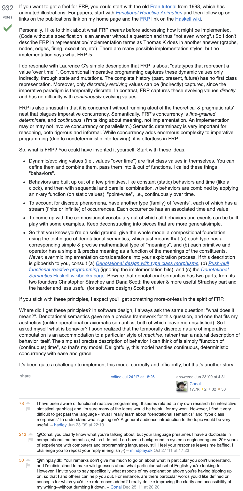

]

.right-half[


]

---

## What is Reactive Programming?

### Reactive Manifesto

Reactive Manifesto sounds like the kind of thing you show to your project manager or the businessmen at your company.

[https://www.reactivemanifesto.org/](https://www.reactivemanifesto.org/)

.left-half[

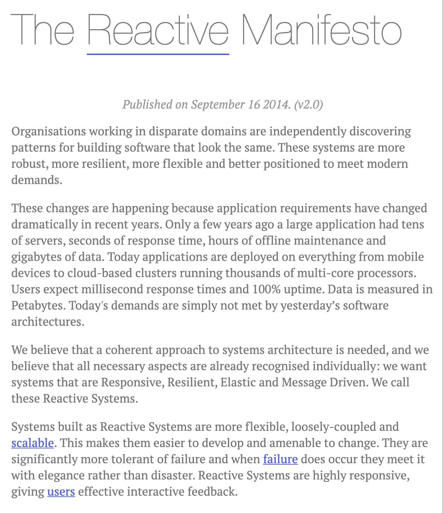

]

.right-half[


]

---

## What is Reactive Programming?

### Microsoft

Microsoft's Rx terminology is so heavy and Microsoftish that most of us are left confused.

> The Reactive Extensions (Rx) is a library for composing asynchronous and event-based programs using observable sequences and LINQ-style query operators.

[https://archive.codeplex.com/?p=rx](https://archive.codeplex.com/?p=rx)

> Rx = Observables + LINQ + Schedulers

---

## What is Reactive Programming?

### Other

Terms like "reactive" and "propagation of change" don't convey anything specifically different to what your typical MV*
and favorite language already does.

Of course my framework views react to the models. Of course change is propagated. If it wouldn't, nothing would be
rendered.

---

## What is Reactive Programming?

### Simple definition

Reactive programming is programming with asynchronous data streams.

---

## Idea

It's not new. Event buses or click events in your projects are an asynchronous event streams.

Reactive is that idea on steroids.

Create streams. It's cheap. Anything can be source: var, list, input, caches, etc.

On top is toolbox with stream manipulations: combine, create, filter, map and other operations.

---

## Idea

### Example

```
a = b + c
```

.left-half[

#### Imperative programming

change `b`:

```b = 2```

`a` stays the same until:

`a = b + c`

]

.right-half[

#### Reactive programming

change `b`:

`b = 2`

`a` automatically recalculated

]

---

## Idea

A stream is a sequence of ongoing events ordered in time.


---

## Idea

`--a---b-c---d---X---|->`

is a marble diagram

`a`, `b`, `c`, `d` are emitted values

`X` is an error

`|` is a 'completed' signal

`--->` is a timeline

It can emit three different things:

* value
* error
* completed signal

---

## Idea

We capture these emitted events only asynchronously, by defining a function that will execute when a value is emitted,
another function when an error is emitted, and another function when 'completed' is emitted.

Subscribing is the "listening" to the stream.

Observers are the functions we are defining.

Subject/Observable is the stream is being observed.


---

## RxJava basics

```kotlin
fun simpleObservable01() {
    val stringObservable = Observable.create<String> { emitter ->
        /* do some work here, e.g. request to a server or a database */
    }
}
```

---

## RxJava basics

```kotlin
fun simpleObservable02() {
    val stringObservable = Observable.create<String> { emitter ->
        /* do some work here, e.g. request to a server or a database */
        emitter.onNext("some value")
    }
    stringObservable.subscribe(
        { value -> /* handle result */ },
        { throwable -> /* handle error */ },
    )
}
```

---

## RxJava basics

```kotlin
fun simpleObservable03() {
    val stringObservable = Observable.create<String> { emitter ->
        /* do some work here, e.g. request to a server or a database */
        emitter.onNext("some value")
    }
    stringObservable
        .subscribeOn(Schedulers.io())
        .observeOn(AndroidSchedulers.mainThread())
        .subscribe(
            { value -> /* handle result */ },
            { throwable -> /* handle error */ },
        )
}
```

---

## RxJava basics

```kotlin
fun simpleObservable04() {
    val stringObservable = Observable.create<String> { emitter ->
        /* do some work here, e.g. request to a server or a database */
        emitter.onNext("some value")
    }
    stringObservable
        .subscribeOn(Schedulers.io())
        .observeOn(AndroidSchedulers.mainThread())
        .filter { emittedValue -> emittedValue.length > 5 }
        .doOnComplete { /* completion handler */ }
        .subscribe(
            { value -> /* handle result */ },
            { throwable -> /* handle error */ },
        )
}
```

---

## RxJava basics

```kotlin
fun simpleObservable05() {
    val stringObservable = Observable.create<String> { emitter ->
        while (!emitter.isDisposed) {
            /* do some intensive work in a loop */
            /* if emitter is not disposed */
            emitter.onNext("more values")
        }
    }
    val disposable = stringObservable
        .subscribeOn(Schedulers.io())
        .observeOn(AndroidSchedulers.mainThread())
        .filter { emittedValue -> emittedValue.length > 5 }
        .subscribe(
            { value -> /* handle result */ },
            { throwable -> /* handle error */ },
            { /* completion handler */ }
        )

    /* to interrupt work */
    disposable.dispose()
}
```

---

## Reasoning

It's hard to reason about reactive programming.

Why reactive programming? Why RxJava? Where is Android?

Why should we learn this?

---

## Story about cars and horses

We are in 19th century

.width-80[


]

---

## Story about cars and horses

Horses are main transpotation


---

## Story about cars and horses

Somebody from future shows you a car


---

## Story about cars and horses

How to use it?

.width-80[


]

---

## Story about cars and horses

Driving signs and conventions

.width-66[


]

---

## Story about cars and horses

Learning and exams

.width-50[


]

---

## Story about cars and horses

Parallel parking


---

## Story about cars and horses

Roads


---

## Story about cars and horses

You seat at the car and nothing happens


---

## Story about cars and horses

You love horses

.width-80[


]

---

## Story about cars and horses

Conquer a whole continent


---

## Story about cars and horses

Nothing bad about horses


---

## Story about cars and horses

but cars are better


---

## Challenges

### Software requirements changed

Resource                | 10 years ago | now          |
------------------------|--------------|--------------|
Server nodes            | 10's         | 1000's       |
Response times          | seconds      | milliseconds |
Maintenance downtimes   | hours        | none         |
Data volume             | GBs          | TBs -> PBs   |
Clients                 | 1-2          | up to 10's   |

---

## Challenges

### Complexity

Technologies count is constantly increasing

Learning curve is high

Complexity is proportional to software size

---

## Challenges

### Costs

Software development

Hardware

Maintenance

---

## Challenges


---

## Reactive programming history

### Founders and evangelists

[Erik Meijer](https://en.wikipedia.org/wiki/Erik_Meijer_(computer_scientist), reactive programming author in Cloud
Programmability Team in Microsoft (in ≈2006).

[David Karnok](https://www.linkedin.com/in/david-karnok-725b3189/), Research Assistant at MTA SZTAKI (Hungary, Budapest)
.

He started in 2010 and made reactive programming in java 2 years before Netflix.

In 2011 published [reactive4java](https://github.com/akarnokd/reactive4java).

In 2013 he merged efforts with Netflix to create RxJava.

Now RxJava counts more than 5k commits since then.

[Ben Christensen](http://benjchristensen.com/), one of men behind Netflix API, RxJava and more, now a Facebook engineer.

---

## Reactive programming history

### Other important people

[Jonas Bonér](http://jonasboner.com/) and [Roland Kuhn](https://rolandkuhn.com/) ‒ creators of Akka (Lightbend) and
Reactive Manifesto authors.

[Stephane Maldini](https://github.com/smaldini), project Reactor lead, prinipal engineer at Pivotal.

[André Staltz](https://staltz.com/), JavaScript expert and reactive programming evangelist.

[Martin Odersky](http://lampwww.epfl.ch/~odersky/), creator of Scala.

---

## JVM implementations

Java <9 CompletableFuture / Java 9 [http://www.reactive-streams.org](http://www.reactive-streams.org/)

RxJava [https://github.com/ReactiveX/RxJava](https://github.com/ReactiveX/RxJava)

Reactor [https://projectreactor.io](https://projectreactor.io/)

Coroutines Channels and
Flow [https://github.com/Kotlin/kotlinx.coroutines](https://github.com/Kotlin/kotlinx.coroutines)

[Akka](https://doc.akka.io/docs/akka/current/guide/actors-motivation.html) in Scala

---

## Android

### RxJava

Targets older Java version (Java6 for RxJava v1 and v2, Java8 for RxJava v3)

A mature and solid library

### Coroutines Channels and Flow

---

## Pre basics

### Iterator pattern

[https://en.wikipedia.org/wiki/Iterator_pattern](https://en.wikipedia.org/wiki/Iterator_pattern)

#### Problems to solve

- the elements of an aggregate object should be accessed and traversed without exposing its representation (data
  structures)
- new traversal operations should be defined for an aggregate object without changing its interface

#### Solution

- define a separate (iterator) object that encapsulates accessing and traversing an aggregate object
- clients use an iterator to access and traverse an aggregate without knowing its representation (data structures)

---

## Pre basics

### Observer pattern

[https://en.wikipedia.org/wiki/Observer_pattern](https://en.wikipedia.org/wiki/Observer_pattern)

#### Problems to solve

- a one-to-many dependency between objects should be defined without making the objects tightly coupled
- it should be ensured that when one object changes state an open-ended number of dependent objects are updated
  automatically
- it should be possible that one object can notify an open-ended number of other objects

#### Solution

- define Subject and Observer objects
- so that when a subject changes state, all registered observers are notified and updated automatically

---

## Basics

Just a stream of data events, but made right


---

## RxJava

push vs pull (backpressure)

async vs sync

concurrency and parallelism (onNext(), onCompleted(), onError() cannot be emmited concurrently, aka thread-safe)

```kotlin
Observable.create<String> { emitter ->
    Thread {
        emitter.onNext("one")
        emitter.onNext("two")
        emitter.onNext("three")
        emitter.onNext("four")
        emitter.onComplete()
    }.start()
}
```

---

## RxJava

Do not do this

```kotlin
/* DO NOT DO THIS */
Observable.create<String> { emitter ->
    Thread {
        emitter.onNext("one")
        emitter.onNext("two")
        emitter.onComplete()
    }.start()

    Thread {
        emitter.onNext("three")
        emitter.onNext("four")
        emitter.onComplete()
    }.start()
}
```

Why not just allow `onNext()` to be invoked concurrently?

* defensive code to check threads
* some operations has to be sync (scan/reduce) to accumulate data
* performance

---

## RxJava

Do this instead

```kotlin
val a = Observable.create<String> { emitter ->
    Thread {
        emitter.onNext("one")
        emitter.onNext("two")
        emitter.onComplete()
    }.start()
}

val b = Observable.create<String> { emitter ->
    Thread {
        emitter.onNext("three")
        emitter.onNext("four")
        emitter.onComplete()
    }.start()
}

val c = Observable.merge(a, b)
```

---

## RxJava

#### Lazy vs Eager

Subscription, not construction starts work

Observables can be reused

#### Duality

An Rx Observable is the async "dual" of an Iterable

#### Cardinality

The Observable supports asynchronously pushing multiple values

Type           | One                 | Many                    |
---------------|---------------------|-------------------------|
synchronous    | `T getData()`       | `Iterable<T> getData()` |
asynchronous   |`Future<T> getData()`|`Observable<T> getData()`|

---

## Functional reactive programming

```           
           asynchronous
           values
           events
           push
functional reactive
lambdas
closures
pure
composable
```

Functional code is idempotent, depends only on arguments.  
Pure functions has no side-effects (no state).

The essence and origins of
FRP [https://github.com/conal/talk-2015-essence-and-origins-of-frp](https://github.com/conal/talk-2015-essence-and-origins-of-frp)
.

---

## Reactive manifesto

- message-driven (react to events / event-driven)
- elastic (react to load / scalable)
- resilient (react to failures)
- responsive (react to users)

```
             responsive
         ↗                ↖
scalable          ↑         resilient
         ↖                ↗
           message-driven 
```

Reactive Manifesto [https://www.reactivemanifesto.org](https://www.reactivemanifesto.org)

Reactive Manifesto
2.0 [https://www.lightbend.com/blog/reactive-manifesto-20](https://www.lightbend.com/blog/reactive-manifesto-20)

---

## RxJava formal definition

RxJava is a Java VM implementation of [Reactive Extensions](http://reactivex.io/): a library for composing asynchronous
and event-based programs by using observable sequences.

It extends the observer pattern to support sequences of data/events and adds operators that allow you to compose
sequences together declaratively while abstracting away concerns about things like low-level threading, synchronization,
thread-safety and concurrent data structures.

Source: [https://github.com/ReactiveX/RxJava](https://github.com/ReactiveX/RxJava)

---

## RxJava contract

An Observable is the asynchronous "dual" to the synchronous/pull Iterable

event          | Iterable (pull)    | Observable           |
---------------|--------------------|----------------------|
retrieve data  | `T next()`         | `onNext(T)`          |
discover error | `throws Exception` | `onError(Exception)` |
complete       | `returns`          | `onCompleted()`      |

`Completable` (0 emits)

`Single` (1 emit)

`Observable`/`Flowable` (many emits)

```kotlin
Completable.fromRunnable { Thread.sleep(1000) }
    .subscribe { println("took ${System.currentTimeMillis() - now} ms") }

Single.fromCallable { calcSomeValue() }
    .subscribe { result -> showCalcedResult(result) }
```

---

## Asynchronous operations

Simple Futures usage

[https://gist.github.com/benjchristensen/4670979](https://gist.github.com/benjchristensen/4670979)

```java
class FuturesA {
    void someMethod() {
        Future<String> f1 = executor.submit(new CallToRemoteServiceA());
        Future<String> f2 = executor.submit(new CallToRemoteServiceB());
        System.out.println(f1.get() + " - " + f2.get());
    }
}
```

---

## Asynchronous operations

How easily Futures can become blocking and prevent other work

[https://gist.github.com/benjchristensen/4671081](https://gist.github.com/benjchristensen/4671081)

```java
class FuturesA {
    void someMethod() {
        // get f3 with dependent result from f1
        Future<String> f1 = executor.submit(new CallToRemoteServiceA());
        Future<String> f3 = executor.submit(new CallToRemoteServiceC(f1.get()));

        // The work below can not proceed until f1.get() 
        // completes even though there is no dependency 

        // also get f4/f5 after dependency f2 completes 
        Future<Integer> f2 = executor.submit(new CallToRemoteServiceB());
        Future<Integer> f4 = executor.submit(new CallToRemoteServiceD(f2.get()));
        Future<Integer> f5 = executor.submit(new CallToRemoteServiceE(f2.get()));

        System.out.println(f3.get() + " => " + (f4.get() * f5.get()));
    }
}
```

---

## Asynchronous operations

Demonstrates how reordering of `Future.get()` can improve the situation but that it still doesn't address differing
response latencies of f1 and f2

[https://gist.github.com/benjchristensen/4671081](https://gist.github.com/benjchristensen/4671081)

```java
class FuturesA {
    void someMethod() {
        // kick of f1/f2 in parallel
        Future<String> f1 = executor.submit(new CallToRemoteServiceA());
        Future<Integer> f2 = executor.submit(new CallToRemoteServiceB());

        // get f3 with dependent result from f1 (blocks)
        Future<String> f3 = executor.submit(new CallToRemoteServiceC(f1.get()));

        // The work below can not proceed until f1.get() 
        // completes even if f2.get() is done. 

        // get f4/f5 after dependency f2 completes (blocks)
        Future<Integer> f4 = executor.submit(new CallToRemoteServiceD(f2.get()));
        Future<Integer> f5 = executor.submit(new CallToRemoteServiceE(f2.get()));

        System.out.println(f3.get() + " => " + (f4.get() * f5.get()));
    }
}
```

---

## Asynchronous operations

Demonstrate how changing where threads are injected can solve the issue of previsous example at the cost of incidental
complexity being added to the code.

This same example could be accomplished by refactoring `CallToRemoteServiceC` to accept a `Future<String>` instead
of `String` but the principle is the same.

[https://gist.github.com/benjchristensen/4671081](https://gist.github.com/benjchristensen/4671081)

---

## Asynchronous operations

```java
class FuturesA {
    void someMethod() {
        // kick of f1/f2 in parallel
        final Future<String> f1 = executor.submit(new CallToRemoteServiceA());
        Future<Integer> f2 = executor.submit(new CallToRemoteServiceB());

        // spawn in another thread so waiting on f1 for f3 doesn't block f4/f5
        Future<String> f3 = executor.submit(new Callable<String>() {

            @Override
            public String call() throws Exception {
                // get f3 with dependent result from f1 (blocks)
                return new CallToRemoteServiceC(f1.get()).call();
            }

        });

        // The following can now proceed as soon as f2.get() 
        // completes even if f1.get() isn't done yet

        // get f4/f5 after dependency f2 completes (blocks)
        Future<Integer> f4 = executor.submit(new CallToRemoteServiceD(f2.get()));
        Future<Integer> f5 = executor.submit(new CallToRemoteServiceE(f2.get()));

        System.out.println(f3.get() + " => " + (f4.get() * f5.get()));
    }
}
```

---

## Asynchronous operations

Demonstrate typical handling of responding to Futures as they complete.

This successfully executes multiple calls in parallel but then synchronously handles each response in the order they
were put in the list rather than the order they complete.

[https://gist.github.com/benjchristensen/4671081](https://gist.github.com/benjchristensen/4671081)

---

## Asynchronous operations

```java
class FuturesA {
    void someMethod() {
        List<Future<?>> futures = new ArrayList<Future<?>>();

        // kick off several async tasks
        futures.add(executor.submit(new CallToRemoteServiceA()));
        futures.add(executor.submit(new CallToRemoteServiceB()));
        futures.add(executor.submit(new CallToRemoteServiceC("A")));
        futures.add(executor.submit(new CallToRemoteServiceC("B")));
        futures.add(executor.submit(new CallToRemoteServiceC("C")));
        futures.add(executor.submit(new CallToRemoteServiceD(1)));
        futures.add(executor.submit(new CallToRemoteServiceE(2)));
        futures.add(executor.submit(new CallToRemoteServiceE(3)));
        futures.add(executor.submit(new CallToRemoteServiceE(4)));
        futures.add(executor.submit(new CallToRemoteServiceE(5)));

        // as each completes do further work

        for (Future<?> f : futures) {
            // this blocks so even if other futures in the list complete
            // earlier they will wait until this one is done 
            doMoreWork(f.get());
        }
    }
}
```

---

## Asynchronous operations

Demonstrate polling approach to handling Futures as they complete. This becomes unwieldy and error prone quickly.

[https://gist.github.com/benjchristensen/4671081](https://gist.github.com/benjchristensen/4671081)

---

## Asynchronous operations

```java
class FuturesA {
    void someMethod() {
        List<Future<?>> futures = new ArrayList<Future<?>>();
        // kick off several async tasks
        futures.add(executor.submit(new CallToRemoteServiceA()));
        futures.add(executor.submit(new CallToRemoteServiceB()));
        futures.add(executor.submit(new CallToRemoteServiceC("A")));
        futures.add(executor.submit(new CallToRemoteServiceC("B")));
        futures.add(executor.submit(new CallToRemoteServiceC("C")));
        futures.add(executor.submit(new CallToRemoteServiceD(1)));
        futures.add(executor.submit(new CallToRemoteServiceE(2)));
        futures.add(executor.submit(new CallToRemoteServiceE(3)));
        futures.add(executor.submit(new CallToRemoteServiceE(4)));
        // as each completes do further work, keep polling until all work is done
        while (futures.size() > 0) {
            // use an iterator so we can remove from it
            Iterator<Future<?>> i = futures.iterator();
            while (i.hasNext()) {
                Future<?> f = i.next();
                if (f.isDone()) {
                    doMoreWork(f.get()); // only do work if the Future is done
                    i.remove();
                }
                // otherwise we continue to the next Future
            }
        }
    }
}
```

---

## Asynchronous operations

Demonstration of nested callbacks which then need to composes their responses together.

Various different approaches for composition can be done but eventually they end up relying upon synchronization
techniques such as the CountDownLatch used here or converge on callback design changes similar to Rx.

[https://gist.github.com/benjchristensen/4677544](https://gist.github.com/benjchristensen/4677544)

How to implement it in Rx

[https://stackoverflow.com/questions/28402376/how-to-compose-observables-to-avoid-the-given-nested-and-dependent-callbacks](https://stackoverflow.com/questions/28402376/how-to-compose-observables-to-avoid-the-given-nested-and-dependent-callbacks)

[https://github.com/Netflix/ReactiveLab/blob/952362b89a4d4115ae0eecf0e73f273ecb27ba98/reactive-lab-gateway/src/main/java/io/reactivex/lab/gateway/routes/RouteForDeviceHome.java](https://github.com/Netflix/ReactiveLab/blob/952362b89a4d4115ae0eecf0e73f273ecb27ba98/reactive-lab-gateway/src/main/java/io/reactivex/lab/gateway/routes/RouteForDeviceHome.java)

---

## Asynchronous operations

Rx makes asynchronous operations easier

Rx avoids callback hell

Easy switching back and forth between threads

---

# Schedulers

Sync and async work

Easy thread switching

Standard schedulers

- computation
- io
- from(Executor executor)
- single
- trampoline (fifo)

AndroidSchedulers

- mainThread

---

# Operators

## Marble diagrams


---

## Desicion tree

[http://reactivex.io/documentation/operators.html#tree](http://reactivex.io/documentation/operators.html#tree)

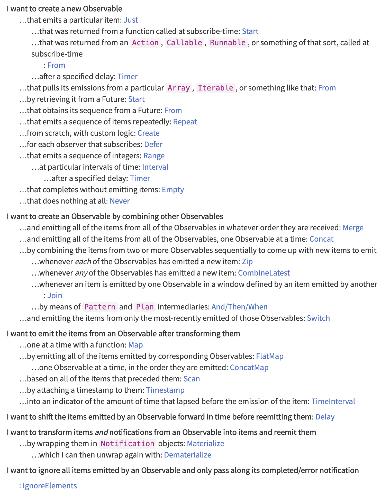

---

## Creating observables

Create


---

## Creating observables

Just


---

## Creating observables

From


---

## Creating observables

Interval


---

## Creating observables

Timer


---

## Creating observables

Range


---

## Filtering observables

Filter


---

## Filtering observables

Distinct


---

## Filtering observables

Skip

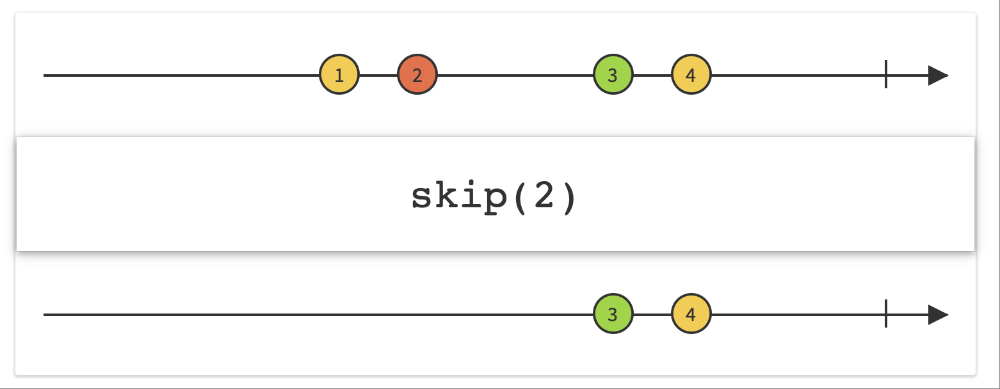

---

## Filtering observables

Debounce

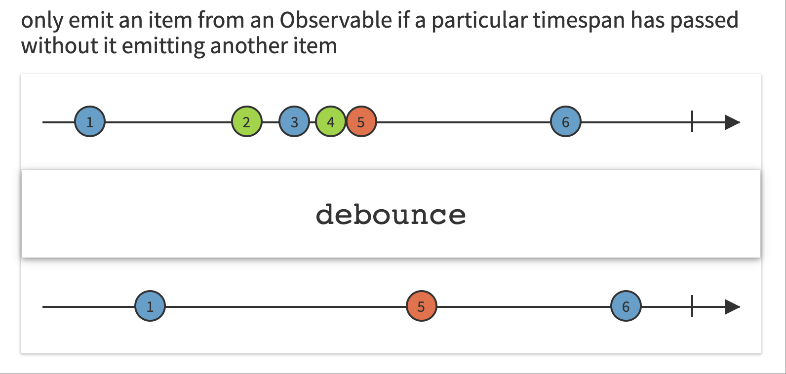

---

## Filtering observables

Throttle

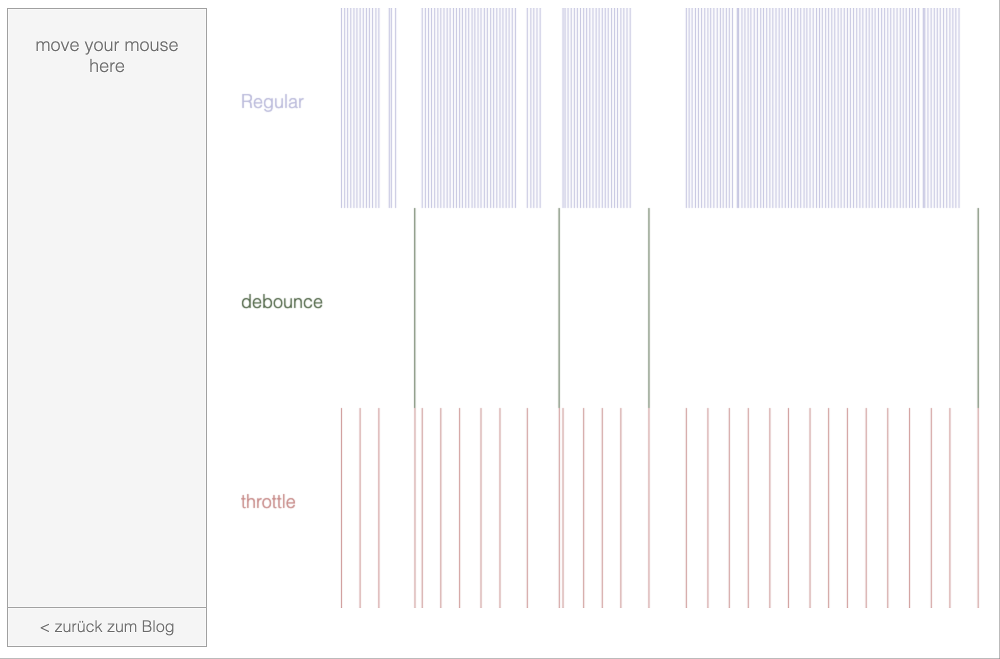

http://demo.nimius.net/debounce_throttle/

---

## Transforming observables

Map


---

## Transforming observables

Buffer


---

## Transforming observables

FlatMap


---

## Combining observables

CombineLatest


---

## Combining observables

Merge


---

## Combining observables

Zip


---

## Combining observables

Concat


---

## Other useful

Contains

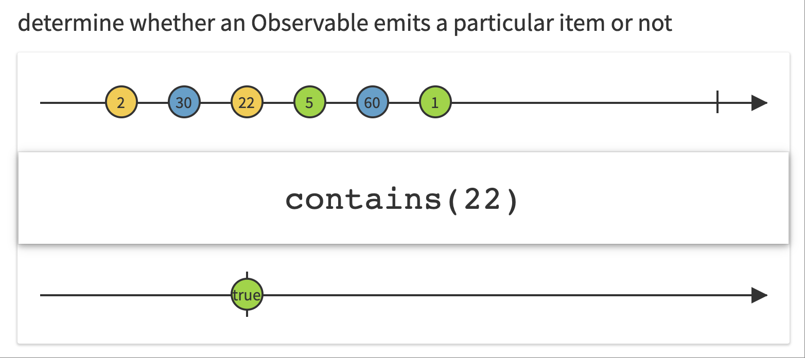

---

## Other useful

Reduce

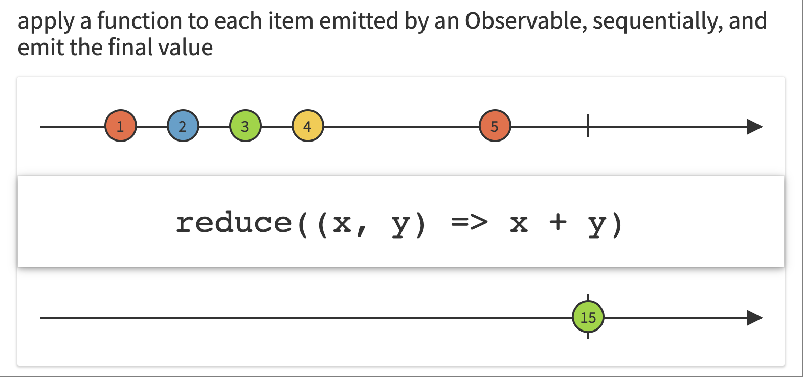

---

## Subjects

PublishSubject


---

## Subjects

BehaviourSubject

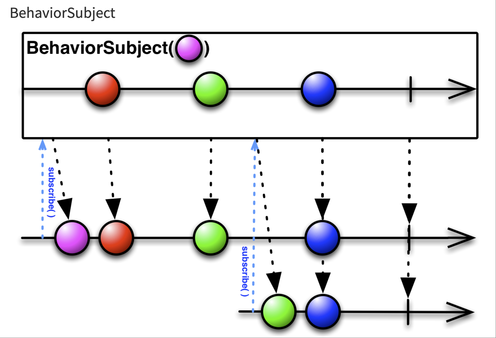

---

## Subjects

ReplaySubject

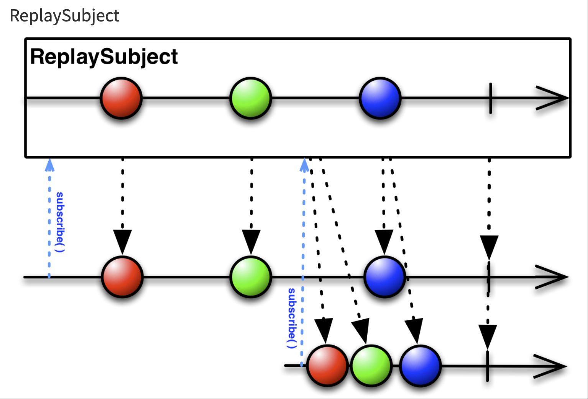

---

## Subjects

AsyncSubject


---

## Backpreassure

Flowable

BackpressureStrategy

- buffer
- drop
- latest

---

## Android deps

```groovy
implementation "io.reactivex.rxjava3:rxjava:3.x.y"

implementation "io.reactivex.rxjava3:rxkotlin:3.x.y"

implementation "io.reactivex.rxjava3:rxandroid:3.x.y"

implementation "com.jakewharton.rxbinding4:rxbinding-core:4.x.y"
```

---

## Simple examples

Throttle button click

```kotlin
val button = findViewById<Button>(R.id.my_button)
button.clicks()
    .throttleLast(500, TimeUnit.MILLISECONDS)
    .observeOn(AndroidSchedulers.mainThread())
    .subscribe { showToast("Millis ${System.currentTimeMillis()}") }
```

---

## Simple examples

Filter even numbers

```kotlin
listOf(1, 2, 3, 4, 5, 6, 7, 8, 9, 10)
    .toObservable()
    .filter { it % 2 == 0 }
    .subscribe { println(it) }
```

---

## Simple examples

Iterating with `forEach()`

```kotlin
Observable.just("some", "words", "to", "print")
    .forEach { println(it) }
```

---

## Simple examples

Group by

```kotlin
Observable.just(1, 2, 3, 4, 5)
    .groupBy { it % 2 == 0 }
    .subscribe { grouped ->
        grouped.toList().subscribe { integers ->
            println("$integers grouped.even: ${grouped.key}")
        }
    }
```

Output

```text
[1, 3, 5] grouped.even: false 
[2, 4] grouped.even: true
```

```kotlin
Observable.just(1, 2, 3, 4, 5)
    .groupBy { it % 2 == 0 }
    .flatMapSingle { grouped -> grouped.toList() }
    .subscribe { integers -> println(integers) }
```

```text
[1, 3, 5]
[2, 4]
```

---

## Simple examples

Take only the first N values emitted

```kotlin
listOf(1, 2, 3, 4, 5).toObservable()
    .take(3)
    .subscribe { println(it) }
```

Take only last error or throw an error

```kotlin
listOf(1, 2, 3, 4, 5).toObservable()
    .lastOrError()
    .subscribe { result -> println("only last $result") }
```

Only distinct elements

```kotlin
listOf(1, 1, 2, 2, 3, 4, 5, 5).toObservable()
    .distinct()
    .subscribe { println("$it") }
```

Output

```text
1, 2, 3, 4, 5
```

---

## Simple examples

Does not have to emit items of the same type as the source Observable

```kotlin
Observable.just("Some string")
    .map { it.hashCode() }
    .subscribe { println("hashCode: $it") }
```

Output

```text
hashCode: -1231765347
```

---

## FlatMap

Transform the items emitted by an Observable into Observables, then flatten the emissions from those into a single
Observable

```kotlin
val scheduler = TestScheduler()
listOf("a", "b", "c", "d", "e", "f")
    .toObservable()
    .flatMap { emittedString ->
        val randomLong = Random.nextLong(30)
        Observable.just("delayed emitted '$emittedString' to ${randomLong}s")
            .delay(randomLong, TimeUnit.SECONDS, scheduler)
    }
    .subscribe { string -> println(string) }
scheduler.advanceTimeBy(1, TimeUnit.MINUTES)
```

Output

```text
delayed emitted 'b' to 3s
delayed emitted 'a' to 7s
delayed emitted 'd' to 15s
delayed emitted 'f' to 16s
delayed emitted 'e' to 17s
delayed emitted 'c' to 26s
```

---

## ConcatMap

Like FlatMap but ordered

```kotlin
val scheduler = TestScheduler()
listOf("a", "b", "c", "d", "e", "f")
    .toObservable()
    .concatMap { emittedString ->
        val randomLong = Random.nextLong(10)
        Observable.just("delayed emitted '$emittedString' to ${randomLong}s")
            .delay(randomLong, TimeUnit.SECONDS, scheduler)
    }
    .subscribe { string -> println(string) }
scheduler.advanceTimeBy(10, TimeUnit.SECONDS)
println("break")
scheduler.advanceTimeBy(20, TimeUnit.SECONDS)
```

Output

```text
delayed emitted 'a' to 3s
delayed emitted 'b' to 2s
delayed emitted 'c' to 1s
break
delayed emitted 'd' to 5s
delayed emitted 'e' to 5s
delayed emitted 'f' to 1s
```

---

## Filter & Debounce

Avoid accidental double clicks with debounce. Server search EditText for example.

```kotlin
val edt = findViewById<EditText>(R.id.my_edt)
edt.textChanges()
    .skipInitialValue()
    .filter { it.length > 3 }
    .debounce(500, TimeUnit.MILLISECONDS)
    .subscribe { Log.d(TAG, "$it") }
```

Output

```text
2021-04-16 20:11:51.776: sea
2021-04-16 20:11:53.152: sear
2021-04-16 20:11:54.118: searc
2021-04-16 20:11:55.088: search
2021-04-16 20:12:01.947: search with de
2021-04-16 20:12:03.200: search with debounce
```

---

## Login form

```kotlin
val loginObs = edtLogin.textChanges()
val passwordObs = edtPassword.textChanges()
btnSubmit.isEnabled = false

Observable.combineLatest(loginObs, passwordObs, { loginObs, passwordObs ->
    val loginCheck = loginObs.length > 3
    val passwordCheck = passwordObs.length > 3
    loginCheck && passwordCheck
}).subscribe { enabled -> btnSubmit.isEnabled = enabled }
```

---

## Thread safety

```kotlin
val textView = findViewById<TextView>(R.id.my_tv)
listOf(1, 2, 3, 4, 5, 6, 7, 8, 9, 10)
    .toObservable()
    .flatMap { number -> heavyCalculation(number) }
    // all the computations will happen in a background thread    
    .subscribeOn(Schedulers.computation())
    // the result subscription will happen in the UI thread    
    .observeOn(AndroidSchedulers.mainThread())
    // do the calcs for each item and return it to observer    
    .subscribe { result -> textView.text = result.toString() }
```

---

## Persist data to the database

```kotlin
val users: List<User> = listOf(user1, user2, user3)
users.toObservable()
    .concatMapCompletable { user -> saveToDb(user) }
    .subscribeOn(Schedulers.io())
    .observeOn(AndroidSchedulers.mainThread())
    .subscribe()
```

---

## RxJava and Android real examples

### Exponential backoff

[https://medium.com/over-engineering/rxify-exponential-backoff-on-retry-48bb66912391](https://medium.com/over-engineering/rxify-exponential-backoff-on-retry-48bb66912391)

```kotlin
private fun exportAt(scale: Double): Bitmap {
    println("export image image at scale $scale")
    return if (scale > 0.24) {
        Bitmap(ByteArray(0))
    } else {
        throw RuntimeException("OutOfMemory")
    }
}
```

```kotlin
sealed class Result {
    data class Success(val double: Double) : Result()
    data class Failed(val error: Throwable) : Result()
}
```

---

## RxJava and Android real examples

### Exponential backoff

[https://medium.com/over-engineering/rxify-exponential-backoff-on-retry-48bb66912391](https://medium.com/over-engineering/rxify-exponential-backoff-on-retry-48bb66912391)

```kotlin
private fun exportProjectWithRetry(): Single<Result> {
    return Observable.range(0, 5)
        .map { input -> 1.0 / (2.0.pow(input)) }
        .concatMapSingle { scale ->
            exportAt(scale)
                .map<Result> { Result.Success(scale) }
                .onErrorReturn { Result.Failed(it) }
        }
        .takeUntil { it is Result.Success }
        .lastOrError()
}
```

---

## RxJava and Android real examples

### Exponential backoff

[https://medium.com/over-engineering/rxify-exponential-backoff-on-retry-48bb66912391](https://medium.com/over-engineering/rxify-exponential-backoff-on-retry-48bb66912391)

```kotlin
exportProjectWithRetry().subscribe { result ->
    when (result) {
        is Result.Failed -> println("success")
        is Result.Success -> println("failure")
    }
}
```

Output

```text
exportAt 1.0
exportAt 0.5
exportAt 0.25
exportAt 0.125
success
```

---

## Some more examples

[Detecting and testing stalled streams](https://www.nurkiewicz.com/2017/09/detecting-and-testing-stalled-stream.html)

```java
class SomeClass {
    void someMethod() {
        Flowable<String> events = /* some stream */;
        Flowable<String> eventsWithPings = events
                .mergeWith(events
                        .debounce(1, SECONDS)
                        .flatMap(x1 -> Flowable
                                .interval(0, 1, SECONDS)
                                .map(e -> "PING")
                                .takeUntil(events)
                        ));
    }
}
```

[Fixed-rate vs fixed-delay](https://www.nurkiewicz.com/2017/09/fixed-rate-vs-fixed-delay-rxjava-faq.html)

```java
class SomeClass {
    void someMethod() {
        Flowable
                .timer(1, SECONDS)
                .flatMapCompletable(i -> doStuffAsync())
                .repeat()
                .subscribe();
    }
}
```

---

## Some more examples

My real life example

```java
class SomeClass {
    @Override public Completable send(
            String eventCode, ChatIds chatIds, long cid, String text
    ) {
        return serviceCommentCacheLoader.loadChat(chatIds)
                .flatMapCompletable(chat -> refreshForward(chat.getId(), eventCode, chatIds, new AtomicBoolean()))
                .observeOn(schedulers.networkIO())
                .andThen(Single.just(mapToRequestJson(chatIds, cid, text)))
                .flatMap(commentRequestJson -> api.comment(eventCode, commentRequestJson))
                .map(this::onCommentApiResponse)
                .observeOn(schedulers.diskIO())
                .map(this::updateMessage)
                .doOnSuccess(message ->
                        // чтобы при kill жило
                        serviceCommentCacheLoader.loadMessages(message.getId())
                ).doOnSuccess(message -> 
                        messageCache.add(message.getChatId(), Collections.singletonList(message))
                ).ignoreElement();
    }
}


```

---

## Managing State with RxJava

[Managing State with RxJava](https://www.youtube.com/watch?v=0IKHxjkgop4), Jake Wharton


---

## Performance

v1 vs v2 vs v3

Tomcat vs Rx performance measures

[Applying Reactive Programming with RxJava](https://speakerdeck.com/benjchristensen/applying-reactive-programming-with-rxjava-at-goto-chicago-2015)
, Ben Christensen

---

## Performance


---

## Performance


---

## Performance


---

## Cons: traditional vs reactive costs

Netflix point by Tomasz Nurkiewicz (backend)

---

## Cons: traditional vs reactive costs

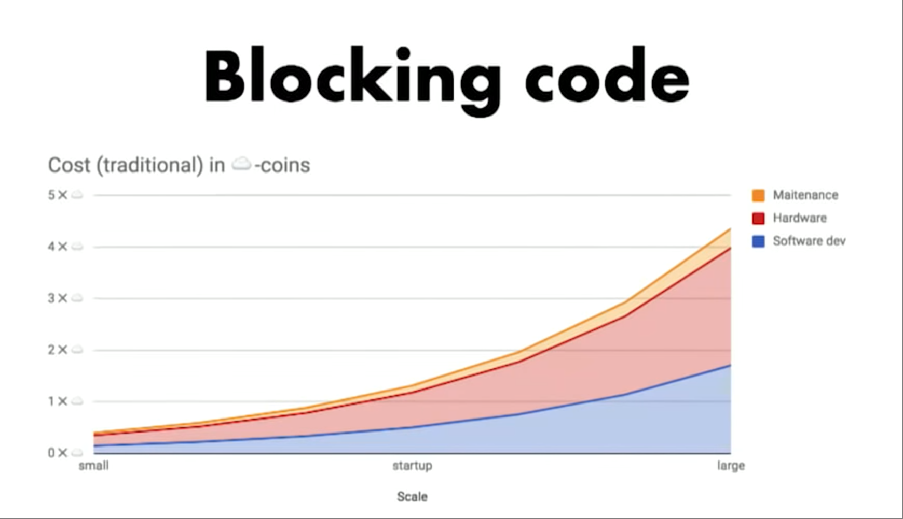

---

## Cons: traditional vs reactive costs

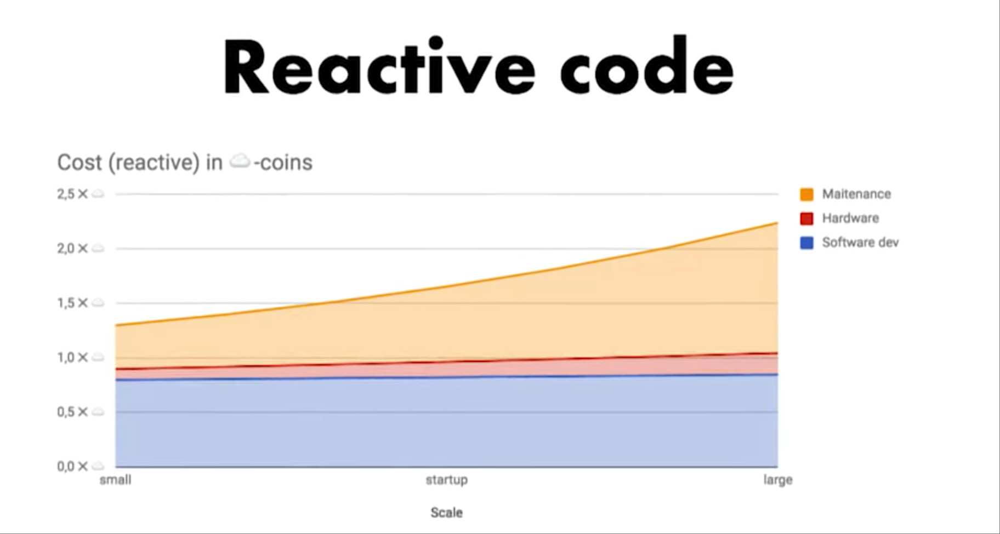

---

## Cons: traditional vs reactive costs

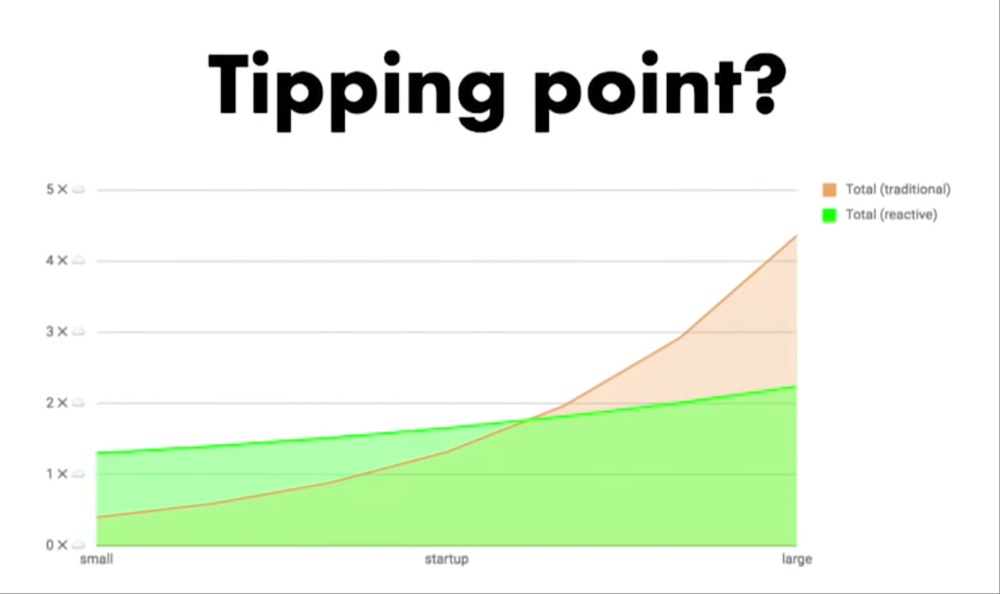

---

.left-half[

## Cons: traditional vs reactive costs

In 2019 12% of world traffic is Netflix
by [Sandvine](https://www.sandvine.com/hubfs/Sandvine_Redesign_2019/Downloads/Internet%20Phenomena/Internet%20Phenomena%20Report%20Q32019%2020190910.pdf)

]

.right-half[

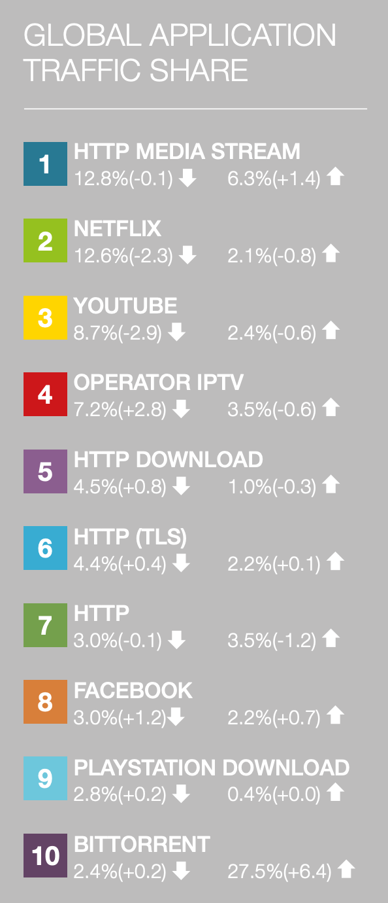

]

---

## Cons: traditional vs reactive costs

### Netflix point


---

## Cons: traditional vs reactive costs

### Netflix point

#### Little's Law

[Little's Law](https://en.wikipedia.org/wiki/Little%27s_law)

`L = λ ⋅ W`

Tomcat, 100 threads (`L`), 100 ms/request (`W`), `λ` - ?

`λ = 1k` requests/second (e.g. on a laptop)

`L` — среднее по времени число запросов в рассматриваемой части системы [шт.],  
`W` — среднее время, за которое запросы проходят через данную часть системы [с],  
`λ` — скорость поступления запросов в систему [шт./с]

[Latency home reading with Little's law explanation](https://habr.com/ru/company/yandex/blog/431650/)

---

## Cons: traditional vs reactive costs

### Netflix point

Have you heard about 'space-time trade off'? (caching)

What about 'human-hardware trade off'?

Usually, to the left of Netflix point, you want to spend as least as possible on development understanding that you
could make balance on pure software buying more servers to solve problems.

But in some cases, to the rigth of Netflix point, humans are more precious than hardware, but in scale you save on
hardware more.

---

## Costs in clients

It's almost the same, but without hardware.

Spend less on development and you get difficult to maintain products.

Spend more and you get less difficulties to maintain.

---

## Simplicity

May you live in interesting times (Chinese curse)

Ubiquitous
language [https://martinfowler.com/bliki/UbiquitousLanguage.html](https://martinfowler.com/bliki/UbiquitousLanguage.html)

### Measure of code quality

What is a universal measure of a code quality?

--

- simple (simple is a matter of taste and expericence)
- tested (crappy code and poor tests)
- open/closed
- SOLID
- high cohesion
- low coupling
- cyclomatic complexity
- DRY ...

---

## Simplicity

### Measuere of code quality

boring

I don't care about language, framework, and particularly reactive library

### Cons: complexity

10x developer

Who is 10x developer?

Who enables 10 other developers

---

## Other cons

It takes some time to dive in

Stacktraces are meaningless (no context)

It is difficult to follow a request as events and callbacks are processed

... unhandled exceptions, and incorrectly handled state changes ... These types of issues have proven to be quite
difficult to debug

Exceptions from hell (NPE)

Timeout exceptions (with no hint where it happend)

Order is no longer guaranteed

Backpressure is difficult

Everyone makes own implementation and terms

---

## Sources 1

Wiki definition [https://en.wikipedia.org/wiki/Reactive_programming](https://en.wikipedia.org/wiki/Reactive_programming)

StackOverflow
definition [https://stackoverflow.com/questions/1028250/what-is-functional-reactive-programming](https://stackoverflow.com/questions/1028250/what-is-functional-reactive-programming)

Reactive Manifesto [https://www.reactivemanifesto.org/](https://www.reactivemanifesto.org/)

Reactive Manifesto
2.0 [https://www.lightbend.com/blog/reactive-manifesto-20](https://www.lightbend.com/blog/reactive-manifesto-20)

Microsoft definition [https://archive.codeplex.com/?p=rx](https://archive.codeplex.com/?p=rx)

The introduction to Reactive Programming you've been missing, Andre Medeiros (alias "Andre Staltz"),
2014, [https://gist.github.com/staltz/868e7e9bc2a7b8c1f754](https://gist.github.com/staltz/868e7e9bc2a7b8c1f754)

Ubiquitous language, Eric
Evans [https://martinfowler.com/bliki/UbiquitousLanguage.html](https://martinfowler.com/bliki/UbiquitousLanguage.html)

[https://en.wikipedia.org/wiki/Observer_pattern](https://en.wikipedia.org/wiki/Observer_pattern)

[https://en.wikipedia.org/wiki/Iterator_pattern](https://en.wikipedia.org/wiki/Iterator_pattern)

Erik
Meijer [https://en.wikipedia.org/wiki/Erik_Meijer_(computer_scientist)](https://en.wikipedia.org/wiki/Erik_Meijer_(computer_scientist))

---

## Sources 2

Jonas Bonér [http://jonasboner.com/](http://jonasboner.com/)

Roland Kuhn [https://rolandkuhn.com/](https://rolandkuhn.com/)

Martin Odersky [http://lampwww.epfl.ch/~odersky/](http://lampwww.epfl.ch/~odersky/)

Stephane Maldini [https://github.com/smaldini](https://github.com/smaldini)

André Staltz [https://staltz.com/](https://staltz.com/)

Podcast with David
Karnok [https://github.com/artem-zinnatullin/TheContext-Podcast/blob/master/show_notes/Episode_3_Part_1.md](https://github.com/artem-zinnatullin/TheContext-Podcast/blob/master/show_notes/Episode_3_Part_1.md)

David Karnok reactive4Java repo [https://github.com/akarnokd/reactive4java](https://github.com/akarnokd/reactive4java)

[https://projectreactor.io/](https://projectreactor.io/)

[http://www.reactive-streams.org/](http://www.reactive-streams.org/)

[http://reactivex.io/](http://reactivex.io/)

[https://github.com/Kotlin/kotlinx.coroutines](https://github.com/Kotlin/kotlinx.coroutines)

[https://doc.akka.io/docs/akka/current/guide/actors-motivation.html](https://doc.akka.io/docs/akka/current/guide/actors-motivation.html)

---

## Sources 3

[https://github.com/ReactiveX/RxJava](https://github.com/ReactiveX/RxJava)

Netflix
architecture [https://medium.com/netflix-techblog/optimizing-the-netflix-api-5c9ac715cf19](https://medium.com/netflix-techblog/optimizing-the-netflix-api-5c9ac715cf19)

Netflix embrace
concurrency [https://medium.com/netflix-techblog/reactive-programming-in-the-netflix-api-with-rxjava-7811c3a1496a](https://medium.com/netflix-techblog/reactive-programming-in-the-netflix-api-with-rxjava-7811c3a1496a)

The essence and origins of
FRP [https://github.com/conal/talk-2015-essence-and-origins-of-frp](https://github.com/conal/talk-2015-essence-and-origins-of-frp)

Some collection of info around RxJava [https://github.com/xiaomeixw/NoRxJava](https://github.com/xiaomeixw/NoRxJava)

Reactive Streams with Rx, Ben
Christensen [https://www.youtube.com/watch?v=g-ixzOcMDF4](https://www.youtube.com/watch?v=g-ixzOcMDF4)

[http://benjchristensen.com/](http://benjchristensen.com/)

[https://speakerdeck.com/benjchristensen/reactive-streams-with-rx-at-javaone-2014](https://speakerdeck.com/benjchristensen/reactive-streams-with-rx-at-javaone-2014)

---

## Sources 4

[https://gist.github.com/benjchristensen/4670979](https://gist.github.com/benjchristensen/4670979)

[https://gist.github.com/benjchristensen/4671081](https://gist.github.com/benjchristensen/4671081)

[https://gist.github.com/benjchristensen/4677544](https://gist.github.com/benjchristensen/4677544)

[https://stackoverflow.com/questions/28402376/how-to-compose-observables-to-avoid-the-given-nested-and-dependent-callbacks](https://stackoverflow.com/questions/28402376/how-to-compose-observables-to-avoid-the-given-nested-and-dependent-callbacks)

[https://github.com/Netflix/ReactiveLab/blob/952362b89a4d4115ae0eecf0e73f273ecb27ba98/reactive-lab-gateway/src/main/java/io/reactivex/lab/gateway/routes/RouteForDeviceHome.java](https://github.com/Netflix/ReactiveLab/blob/952362b89a4d4115ae0eecf0e73f273ecb27ba98/reactive-lab-gateway/src/main/java/io/reactivex/lab/gateway/routes/RouteForDeviceHome.java)

Cycle.js and functional reactive user interfaces, Andre
Staltz, [https://youtu.be/uNZnftSksYg?t=545](https://youtu.be/uNZnftSksYg?t=545)

What is reactive programming, Martin
Odersky [https://www.youtube.com/watch?v=7D9QfMj_KwI](https://www.youtube.com/watch?v=7D9QfMj_KwI)

Reactive programming: lessons learned by Tomasz
Nurkiewicz [https://www.youtube.com/watch?v=5TJiTSWktLU](https://www.youtube.com/watch?v=5TJiTSWktLU)

---

## Sources 5

Exploring RxJava 2 for Android, Jake
Wharton [https://www.youtube.com/watch?v=htIXKI5gOQU](https://www.youtube.com/watch?v=htIXKI5gOQU)

Managing State with RxJava, Jake
Wharton [https://www.youtube.com/watch?v=0IKHxjkgop4](https://www.youtube.com/watch?v=0IKHxjkgop4)

Java Streams vs Reactive Streams: Which, When, How, and Why? by Venkat
Subramaniam [https://www.youtube.com/watch?v=kG2SEcl1aMM](https://www.youtube.com/watch?v=kG2SEcl1aMM)

Reactive Programming in Java by Venkat
Subramaniam [https://www.youtube.com/watch?v=f3acAsSZPhU](https://www.youtube.com/watch?v=f3acAsSZPhU)

RxJava доставляет, Artem
Zinnatullin [https://www.youtube.com/watch?v=3jdvLrYZfB4](https://www.youtube.com/watch?v=3jdvLrYZfB4)

Latency explained with Little's Law (
ru) [https://habr.com/ru/company/yandex/blog/431650/](https://habr.com/ru/company/yandex/blog/431650/)

Tomcat vs rx performance
measures [https://speakerdeck.com/benjchristensen/applying-reactive-programming-with-rxjava-at-goto-chicago-2015](https://speakerdeck.com/benjchristensen/applying-reactive-programming-with-rxjava-at-goto-chicago-2015)

---

## Sources 6

Simple RxJava
examples [https://gist.github.com/cesarferreira/510aa2456dc0879f559f](https://gist.github.com/cesarferreira/510aa2456dc0879f559f)

Exponential
backoff [https://medium.com/over-engineering/rxify-exponential-backoff-on-retry-48bb66912391](https://medium.com/over-engineering/rxify-exponential-backoff-on-retry-48bb66912391)

Detecting and testing stalled
streams [https://www.nurkiewicz.com/2017/09/detecting-and-testing-stalled-stream.html](https://www.nurkiewicz.com/2017/09/detecting-and-testing-stalled-stream.html)

Fixed-rate vs.
fixed-delay [https://www.nurkiewicz.com/2017/09/fixed-rate-vs-fixed-delay-rxjava-faq.html](https://www.nurkiewicz.com/2017/09/fixed-rate-vs-fixed-delay-rxjava-faq.html)

debounce vs throttle [http://demo.nimius.net/debounce_throttle/](http://demo.nimius.net/debounce_throttle/)
